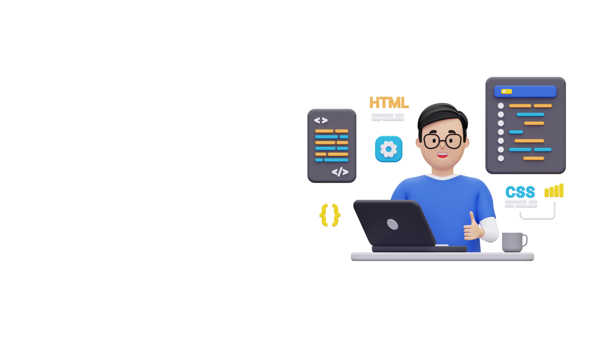

# Portifolio-Ferraz

# Meu Portfólio

Este é o meu portfólio pessoal, onde apresento um pouco sobre mim, meus projetos e como entrar em contato. O objetivo é mostrar minhas habilidades como desenvolvedor Front End e fornecer um meio de comunicação fácil e direto.

## Tabela de Conteúdos
- [Demonstração](#demonstração)
- [Instalação](#instalação)
- [Tecnologias Utilizadas](#tecnologias-utilizadas)
- [Contato](#contato)

## Demonstração

Você pode acessar o portfólio através deste [link](https://linkdoproyeto.com).

### Página Inicial


### Sobre Mim


### Projetos


## Instalação

Para rodar o projeto localmente, siga os passos abaixo:

1. Clone o repositório:
   ```sh
   git clone https://github.com/LeandroFerraz31/meu-portfolio.git


### Explicação de Cada Seção

1. **Título e Descrição Breve**: Apresenta o nome do projeto e uma breve descrição sobre o objetivo e o conteúdo do portfólio.
2. **Tabela de Conteúdos**: Facilita a navegação pelo README.
3. **Demonstração**: Inclui links e imagens de demonstração das principais seções do portfólio.
4. **Instalação**: Fornece instruções simples para rodar o projeto localmente.
5. **Tecnologias Utilizadas**: Lista as principais tecnologias usadas no desenvolvimento do projeto.
6. **Contato**: Links para as suas redes sociais e um meio de contato direto.

Você pode ajustar o conteúdo conforme necessário, adicionando ou removendo seções conforme a complexidade e os detalhes do seu projeto.

